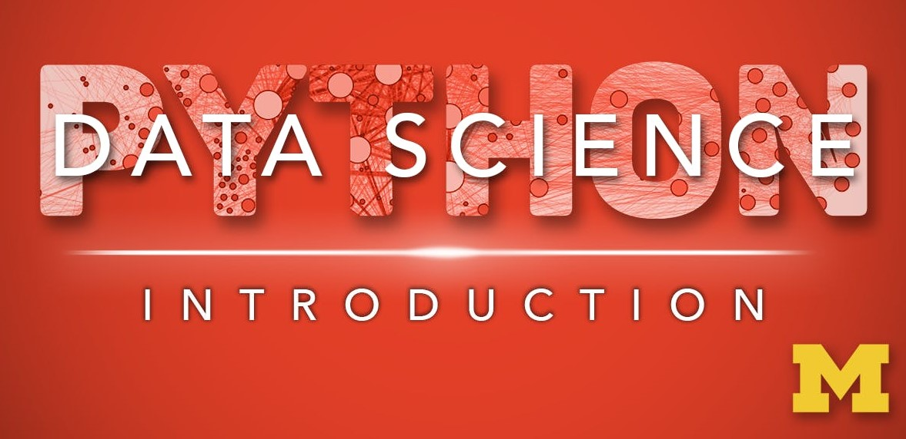
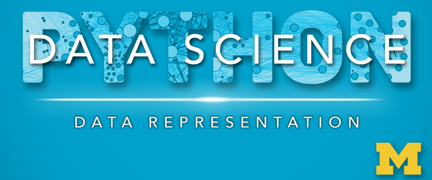

# Applied Data Science with Python -Specialization

The 5 courses in this University of Michigan specialization introduce learners to data science through the python programming language. This skills-based specialization is intended for learners who have a basic python or programming background, and want to apply statistical, machine learning, information visualization, text analysis, and social network analysis techniques through popular python toolkits such as pandas, matplotlib, scikit-learn, nltk, and networkx to gain insight into their data.

Introduction to Data Science in Python (course 1), Applied Plotting, Charting & Data Representation in Python (course 2), and Applied Machine Learning in Python (course 3) should be taken in order and prior to any other course in the specialization.  After completing those, courses 4 and 5 can be taken in any order.  All 5 are required to earn a certificate.

&nbsp;

&nbsp;

---

## [Course no.1 : Introduction to Data Science in Python](https://github.com/muhamedyoussry/Data-Science-Specialization-/tree/main/Course%20no.1%20%20Introduction%20to%20Data%20Science%20in%20Python)

> About this Course

This course will introduce the learner to the basics of the python programming environment, including fundamental python programming techniques such as lambdas, reading and manipulating csv files, and the numpy library.

The course will introduce data manipulation and cleaning techniques using the popular python pandas data science library and introduce the abstraction of the Series and DataFrame as the central data structures for data analysis, along with tutorials on how to use functions such as groupby, merge, and pivot tables effectively. By the end of this course, students will be able to take tabular data, clean it, manipulate it, and run basic inferential statistical analyses.

> Basic info

Course 1 of 5 in the [Applied Data Science with Python Specialization](https://www.coursera.org/specializations/data-science-python) 

> Level

    

&nbsp;

&nbsp;

---

## [Course no.2 : Applied Plotting, Charting & Data Representation in Python](https://github.com/muhamedyoussry/Data-Science-Specialization/tree/main/Course%20no.2%20Applied%20Plotting%2C%20Charting%20%26%20Data%20Representation%20in%20Python)

> About this Course

This course will introduce the learner to information visualization basics, with a focus on reporting and charting using the matplotlib library. The course will start with a design and information literacy perspective, touching on what makes a good and bad visualization, and what statistical measures translate into in terms of visualizations. The second week will focus on the technology used to make visualizations in python, matplotlib, and introduce users to best practices when creating basic charts and how to realize design decisions in the framework. The third week will be a tutorial of functionality available in matplotlib, and demonstrate a variety of basic statistical charts helping learners to identify when a particular method is good for a particular problem. The course will end with a discussion of other forms of structuring and visualizing data. 

This course should be taken after Introduction to Data Science in Python and before the remainder of the Applied Data Science with Python courses: Applied Machine Learning in Python, Applied Text Mining in Python, and Applied Social Network Analysis in Python.

> Basic info

Course 2 of 5 in the [Applied Data Science with Python Specialization](https://www.coursera.org/learn/python-plotting) 

> Level

    

&nbsp;

---